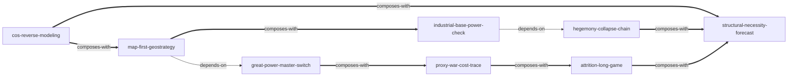

# 《七哥论国际：直播文字稿 2023-2026》 — Skill Index

> 本书由 cangjie-skill 蒸馏，共产出 **8** 个 skills。
> 处理时间: 2026-08-12

## 关于这本书

- **作者**: 主播“七哥”（“七哥论国际”）
- **发布时间**: 2023-12 至 2026-08（84 篇直播文字稿，约 138 万字）
- **一句话主旨**: 用“地理位势 + 工业实力 + 中美博弈总开关”解释一切国际事件，证明美霸权必然衰落、世界正按中国剧本走向多极化。
- **整书理解**: 见 [BOOK_OVERVIEW.md](./BOOK_OVERVIEW.md)
- **精华长文** (不读全书看这篇): [DIGEST.md](./DIGEST.md)
- **术语词典**: [GLOSSARY.md](./GLOSSARY.md)
- **验证记录**: [verified.md](./verified.md) | 淘汰记录: [rejected/](./rejected/)

---

## Skill 列表 (按主题分组)

### 元方法（如何分析任何评论者）

- [`cos-reverse-modeling`](./cos-reverse-modeling/SKILL.md) — 从大量政治文本反向建模一个人的“认知操作系统”，输出可外推的说明书。

### 解释引擎（如何看世界）

- [`map-first-geostrategy`](./map-first-geostrategy/SKILL.md) — 地图优先的地理位势分析：位置→战略价值→必争逻辑→宿敌推演。
- [`industrial-base-power-check`](./industrial-base-power-check/SKILL.md) — 工业体系国力评估：查地基（电力/重工业/供应链/纵深），金融科技降级为结果。
- [`great-power-master-switch`](./great-power-master-switch/SKILL.md) — 中美总开关/大格局归因：区域事件是大国博弈的外溢，问“对谁有利、谁买单”。

### 冲突与预测

- [`hegemony-collapse-chain`](./hegemony-collapse-chain/SKILL.md) — 霸权串行链与纸老虎验证：军事→美元→资本，威慑不可兑现即塌方开始。
- [`proxy-war-cost-trace`](./proxy-war-cost-trace/SKILL.md) — 代理人战争成本账：谁出钱、谁出人、谁买单、谁当前排，成本不对称者先动摇。
- [`attrition-long-game`](./attrition-long-game/SKILL.md) — 消耗战与马拉松时间观：强者拖、弱者赌，先急者暴露底牌。
- [`structural-necessity-forecast`](./structural-necessity-forecast/SKILL.md) — 结构必然性预测：数退路判“必然出手/必然塌方/必然换政权”，叠加时间表。

---

## 引用图



图例:
- `-->` depends-on
- `-.->` contrasts-with（本组无对比关系）
- `===>` composes-with

---

## 推荐学习顺序

1. **cos-reverse-modeling** — 元方法，先理解“这些 skill 是怎么从语料里长出来的”。
2. **map-first-geostrategy** — 最基础的分析引擎，无前置依赖。
3. **industrial-base-power-check** — 第二个基础引擎，与地图互为补充。
4. **great-power-master-switch** — 依赖地图/工业，做全局归因。
5. **proxy-war-cost-trace** — 依赖总开关，做冲突细节推演。
6. **hegemony-collapse-chain** — 依赖工业评估，做体系级判断。
7. **attrition-long-game** — 节奏与耐力判断，组合前面所有输入。
8. **structural-necessity-forecast** — 终端预测引擎，聚合霸权链+马拉松。

---

## 安装使用

本目录是构建产物，宿主不会从这里加载 skill。要让 agent 真正调用，把 skill 目录复制到宿主的 skills 目录：

```bash
# 用户级 (所有项目可用)
cp -r cos-reverse-modeling ~/.codex/skills/
cp -r map-first-geostrategy ~/.codex/skills/
# ... 其余 6 个同理

# 或项目级
cp -r <skill-slug> <project>/.codex/skills/
```

> 注意：本机为 Codex 环境，用户级目录为 `C:\Users\HWC\.codex\skills\`（需用户确认后安装；安装前已完成自产 skill 安全审查，无脚本/无网络/纯 Markdown+JSON）。

---

## 接入 darwin-skill

所有 skill 均带有 `test-prompts.json`（darwin-skill 兼容格式），可直接接入自动进化：

```
darwin evolve books/qige-geopolitics/
```

---

## 审计轨迹

- 候选单元池: [candidates/](./candidates/)
- 被淘汰的候选 (含原因): [rejected/](./rejected/)
- BOOK_OVERVIEW: [BOOK_OVERVIEW.md](./BOOK_OVERVIEW.md)
